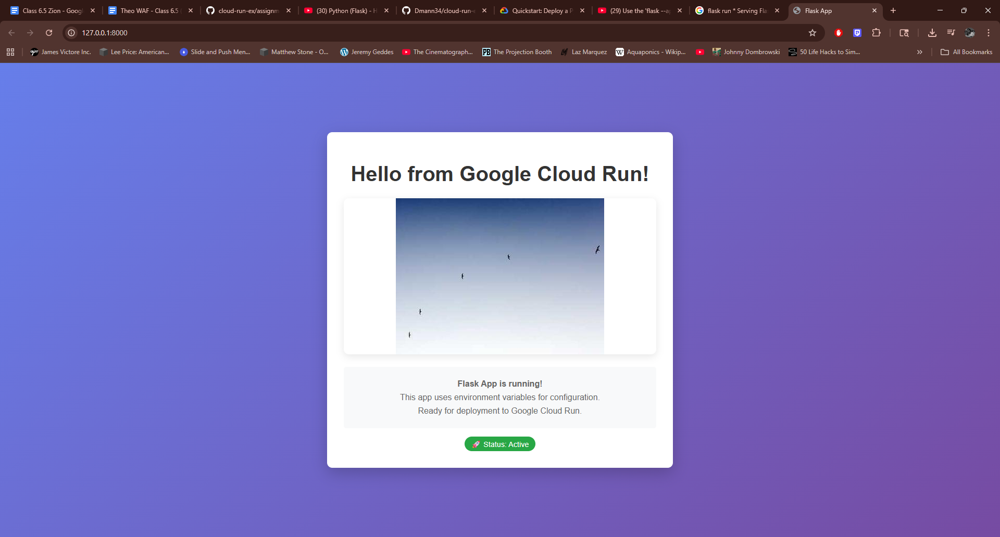

# BE A MAN CHALLENGE 10

## Environment Variables

| Variable | Description | Default |
|----------|-------------|---------|
| `PORT` | Port number for the app | `5000` |
| `HEADER_TEXT` | Text displayed at the top | `Welcome to Flask!` |
| `IMAGE_URL` | Direct URL to an image | None |
| `FLASK_DEBUG` | Enable debug mode | `false` |

## Quick Start

### Clone and setup
   ```bash
   git clone https://github.com/aaron-dm-mcdonald/cloud-run-ex.git
   cd cloud-run-ex
        and
   git clone https://github.com/Dmann34/new-cloud-run-ex-test.git
   ```

### Local Test

1. **Run the app**
   ```bash
   pip install -r requirements.txt
   python main.py
   export FLASK_APP=main.py
   flask run --port 8080
   ```

2. **Visit** `http://127.0.0.1:8000/`


## .env file
```bash
HEADER_TEXT="My Awesome App"
IMAGE_URL=https://picsum.photos/400/300
FLASK_DEBUG=false
      and
HEADER_TEXT=Welcome To Google Cloud Run!
FLASK_DEBUG=false
IMAGE_URL=https://picsum.photos/400/300
PORT=
```
## Preview



## Endpoints

- `GET /` - Main page with configurable content
- `GET /health` - Health check endpoint

## Dependencies

- **Flask** - Web framework
- **python-dotenv** - Environment variable management
- **gunicorn** - WSGI server for production

## GCP APIs

- `gcloud services enable artifactregistry.googleapis.com`
- `gcloud services enable cloudbuild.googleapis.com`


